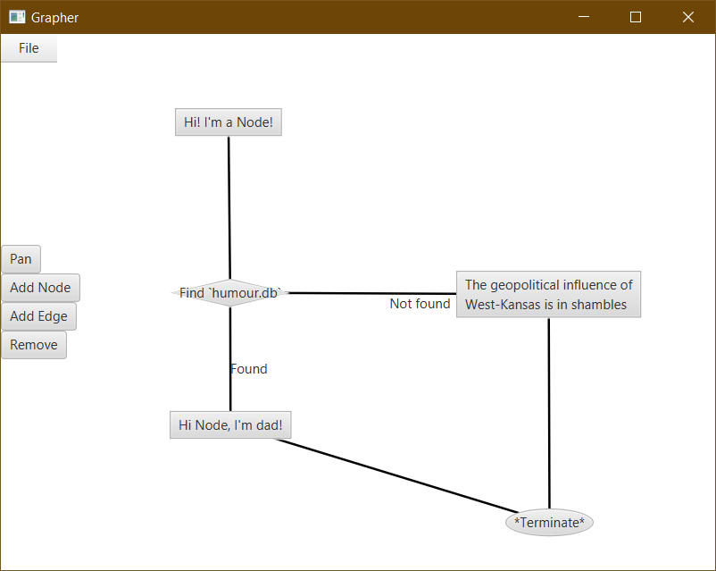

# Grapher

This is a rudimentary graph-making JFX application.

## Functions
* Add, Delete, Move Nodes
* Change shape of nodes
* Add, Delete Edges
* Label Nodes and Edges with custom text
* Pan a theoretically infinite canvas
* Save, Load graphs in JSON

## The GUI

## The corresponding json
```json
{
    "nodes": [
        {"id": 1, "x": 168.8, "y": 172.0,
            "text": "Hi! I'm a Node!",
            "shape": "RECTANGLE"
        },
        {"id": 2, "x": 164.8, "y": 324.8,
            "text": "Find `humour.db`",
            "shape": "RIGHT_TRI"
        },
        {"id": 3, "x": 420.8, "y": 317.6,
            "text": "The geopolitical influence of\nWest-Kansas is in shambles",
            "shape": "RECTANGLE"
        },
        {"id": 4, "x": 464.8, "y": 530.4,
            "text": "*Terminate*",
            "shape": "CIRCLE"
        },
        {"id": 5, "x": 164.0, "y": 443.1,
            "text": "Hi Node, I'm dad!",
            "shape": "RECTANGLE"
        }
    ],
    "edges": [
        {"id": 1, "from": 0, "to": 1, "text": ""},
        {"id": 2, "from": 1, "to": 2, "text": "Not found"},
        {"id": 3, "from": 1, "to": 4, "text": "Found"},
        {"id": 4, "from": 4, "to": 3, "text": ""},
        {"id": 5, "from": 2, "to": 3, "text": ""}
    ],
}
```